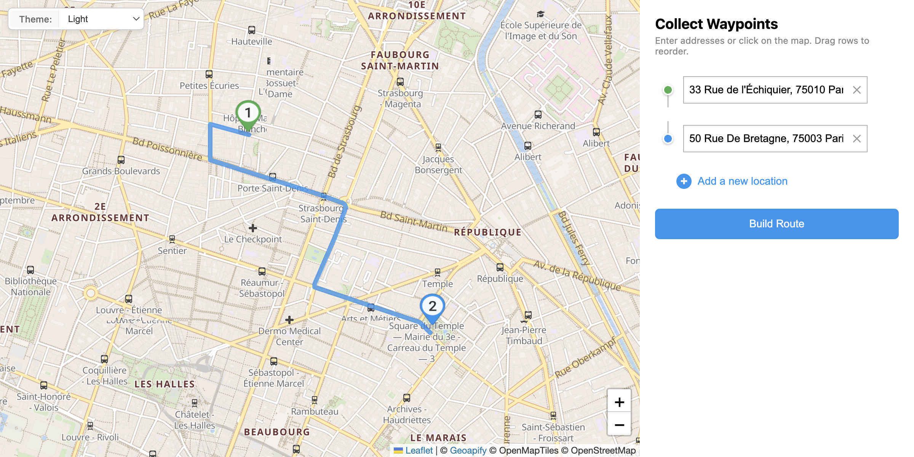

# Waypoints Collection with Autocomplete and Map

Collect route waypoints using address autocomplete, map clicks, and drag-and-drop reordering, then build routes with the Routing API.

## Quick Summary

- Problem: Build an intuitive interface for collecting multiple waypoints for routing.
- Solution: Combine address autocomplete, map click reverse geocoding, and drag-to-reorder functionality.
- Stack: HTML, CSS, JavaScript, Leaflet, Geoapify Geocoder Autocomplete.
- APIs: Geoapify Routing API, Geoapify Geocoding API, Geoapify Marker Icon API, Geoapify Map Tiles API.

## What This Example Includes

- Leaflet map with theme-aware tiles (light/dark)
- Address autocomplete for each waypoint
- Click map to fill next empty waypoint (reverse geocoding)
- Drag markers to reposition waypoints
- Drag-and-drop to reorder waypoint list
- Build route button to calculate and display route
- Theme selector with matching map tiles
- Source-based run from `src/index.html` (no build step)

## Use Cases

- Build delivery route planning interfaces.
- Create trip planners with address search.
- Learn multi-input waypoint collection patterns.

## Live Demo

[](https://codepen.io/team/geoapify/pen/bNeNVNJ)

## Screenshot



## Quick Start

Open [`src/index.html`](./src/index.html) in your browser.

No local server is required.

Note: In rare cases, browser policies or extensions can restrict `file://` access. If that happens, run a local static server and open `src/index.html` via `http://localhost`, or use your IDE's "Open with Live Server" (or similar) option.

## Input and Output

- Input: Address text (autocomplete), map clicks, drag gestures, Geoapify API key.
- Output: Ordered waypoint list, markers on map, calculated route with GeoJSON visualization.

## Project Structure

| File | Purpose |
|------|---------|
| `src/index.html` | Source HTML |
| `src/script.js` | Source JavaScript (autocomplete, geocoding, routing) |
| `src/style.css` | Source CSS |

## Code Samples

### Minimal HTML

```html
<!DOCTYPE html>
<html lang="en">
<head>
  <meta charset="UTF-8">
  <title>Waypoints Collection</title>
  <link rel="stylesheet" href="https://unpkg.com/leaflet@1.9.4/dist/leaflet.css">
  <link rel="stylesheet" href="https://cdn.jsdelivr.net/npm/@geoapify/geocoder-autocomplete@3.0.1/styles/minimal.css">
  <style>
    #map { height: 400px; }
    #waypoints > div { position: relative; z-index: 1000; }
  </style>
</head>
<body>
  <div id="waypoints"></div>
  <button onclick="buildRoute()">Build Route</button>
  <div id="map"></div>
  <script src="https://unpkg.com/leaflet@1.9.4/dist/leaflet.js"></script>
  <script src="https://cdn.jsdelivr.net/npm/@geoapify/geocoder-autocomplete@3.0.1/dist/index.min.js"></script>
  <script src="script.js"></script>
</body>
</html>
```

### Minimal JavaScript

```js
// Demo API key for quickstart only.
// Register for your own free API key at https://myprojects.geoapify.com/.
// Benefits: usage analytics, project-level limits, and reliable access for production use.
// This demo key can be blocked or restricted at any time.
const yourAPIKey = "YOUR_API_KEY";

const map = L.map("map").setView([52.52, 13.405], 11);
L.tileLayer(`https://maps.geoapify.com/v1/tile/osm-bright/{z}/{x}/{y}.png?apiKey=${yourAPIKey}`).addTo(map);

let waypoints = [{ lat: null, lon: null }, { lat: null, lon: null }];

waypoints.forEach((wp, i) => {
  const container = document.createElement("div");
  container.id = `ac-${i}`;
  document.getElementById("waypoints").appendChild(container);
  
  const ac = new autocomplete.GeocoderAutocomplete(container, yourAPIKey, { placeholder: `Waypoint ${i + 1}` });
  ac.on("select", (loc) => {
    if (loc) { wp.lat = loc.properties.lat; wp.lon = loc.properties.lon; }
  });
});

async function buildRoute() {
  const valid = waypoints.filter((w) => w.lat && w.lon);
  if (valid.length < 2) return;
  const param = valid.map((w) => `${w.lat},${w.lon}`).join("|");
  const res = await fetch(`https://api.geoapify.com/v1/routing?waypoints=${param}&mode=drive&apiKey=${yourAPIKey}`);
  const data = await res.json();
  if (data.features?.[0]) L.geoJSON(data.features[0], { style: { color: "#3b82f6", weight: 5 } }).addTo(map);
}
```

## Customize

1. Open [`src/script.js`](./src/script.js).
2. Set your own API key in `yourAPIKey`.
3. Modify `TILES` object for different map themes.
4. Adjust `COLORS` array for waypoint marker colors.
5. Change initial map view in `L.map().setView()`.

API documentation:
- [Geoapify Routing API](https://apidocs.geoapify.com/docs/routing/)
- [Geoapify Address Autocomplete API](https://apidocs.geoapify.com/docs/geocoding/address-autocomplete/)
- [Geoapify Reverse Geocoding API](https://apidocs.geoapify.com/docs/geocoding/reverse-geocoding/)
- [Geoapify Map Tiles API](https://apidocs.geoapify.com/docs/maps/map-tiles/)
- [Geoapify Marker Icon API](https://apidocs.geoapify.com/docs/icon/)

No build step is required. Edit files in `src/` and refresh the browser.

## Troubleshooting

| Problem | Likely Cause | What to Do |
|---------|--------------|------------|
| Autocomplete not loading | Geocoder Autocomplete CSS/JS failed to load | Open browser DevTools (`Console` + `Network`) and confirm CDN files load without errors. |
| Map does not load data / API responds `403` | API key is invalid, restricted, or over limits | Get your own free key at `https://myprojects.geoapify.com/`, then update `yourAPIKey` in `src/script.js`. |
| Works inconsistently from local file | Browser policy blocks some `file://` behavior | Open with IDE Live Server (or any local static server) and run from `http://localhost`. |
| Output differs from expected | Local edits introduced a regression | Compare your files with the [CodePen demo](https://codepen.io/team/geoapify/pen/bNeNVNJ) and align differences step by step. |

## APIs and Libraries

| Type | Name | Link | API Endpoint Used |
|------|------|------|-------------------|
| API | Geoapify Routing API | [Routing API](https://www.geoapify.com/routing-api/) | `https://api.geoapify.com/v1/routing?waypoints=...&mode=drive&apiKey=...` |
| API | Geoapify Geocoding API | [Geocoding API](https://www.geoapify.com/geocoding-api/) | `https://api.geoapify.com/v1/geocode/reverse?lat=...&lon=...&apiKey=...` |
| API | Geoapify Marker Icon API | [Marker Icon API](https://www.geoapify.com/map-marker-icon-api/) | `https://api.geoapify.com/v2/icon?type=awesome&...&apiKey=...` |
| API | Geoapify Map Tiles API | [Map Tiles API](https://www.geoapify.com/map-tiles/) | `https://maps.geoapify.com/v1/tile/osm-bright/{z}/{x}/{y}@2x.png?apiKey=...` |
| Library | Leaflet | [leafletjs.com](https://leafletjs.com/) | Not applicable |
| Library | Geoapify Geocoder Autocomplete | [npm](https://www.npmjs.com/package/@geoapify/geocoder-autocomplete) | Not applicable |

## Related Examples

| Example | Description | Link |
|---------|-------------|------|
| Route Drag Edit | Add via points by dragging route | [Open](../route-drag-edit-leaflet) |
| Address Form Map | Address search with interactive map | [Open](../../geocoder-autocomplete/address-form-map-combined-address-search-with-interactive-map) |
| Leaflet Integration | Address search with markers | [Open](../../geocoder-autocomplete/leaflet-integration-address-search-and-markers-on-interactive-map) |

## Useful Links

- Geoapify API docs: [https://apidocs.geoapify.com/](https://apidocs.geoapify.com/)
- CodePen demo: [https://codepen.io/team/geoapify/pen/bNeNVNJ](https://codepen.io/team/geoapify/pen/bNeNVNJ)
- Geoapify CodePen profile: [https://codepen.io/team/geoapify](https://codepen.io/team/geoapify)

## License

MIT

**Keywords**: waypoints collection, address autocomplete, reverse geocoding, drag reorder, route planning, multi-stop routing
