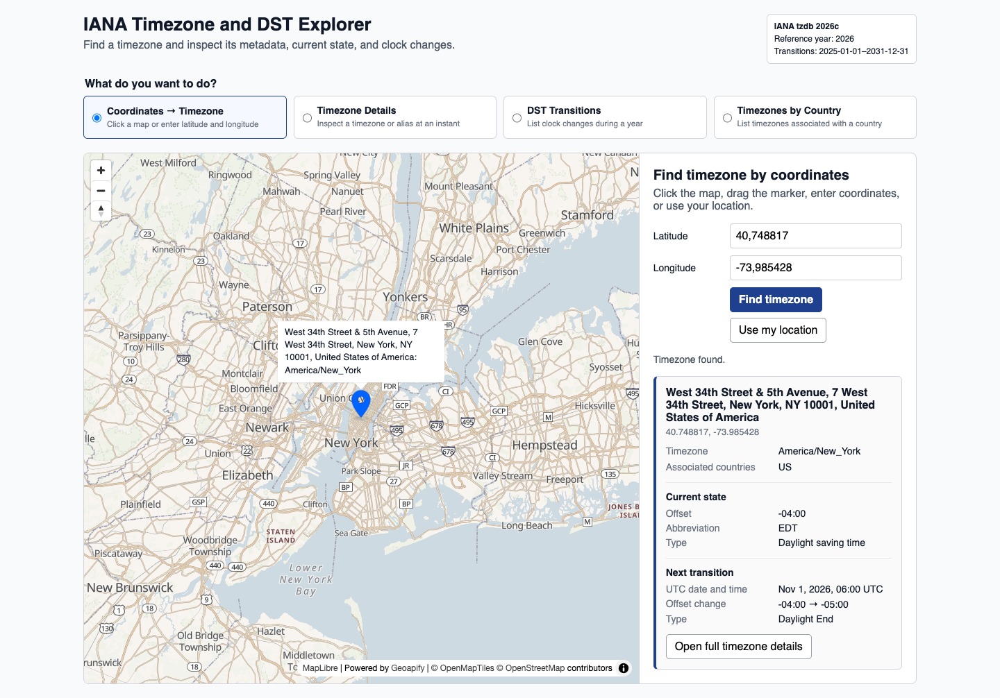

# IANA Timezone and DST Explorer with Geoapify

Build an interactive IANA timezone explorer that finds a timezone from coordinates and shows canonical identifiers, aliases, UTC offsets, daylight-saving states, transitions, and country associations with [`@geoapify/iana-timezone-metadata`](https://www.npmjs.com/package/@geoapify/iana-timezone-metadata).

## Overview

This browser-based example organizes timezone lookup into four user tasks:

- Find a timezone by clicking a MapLibre map, dragging a Geoapify Map Marker API icon, entering coordinates, or using browser location.
- Inspect timezone metadata at a selected UTC instant.
- List DST and other timezone state transitions during a year.
- List the canonical IANA timezones associated with a country.

[Geoapify Reverse Geocoding](https://apidocs.geoapify.com/docs/geocoding/reverse-geocoding/) resolves coordinates to `timezone.name`. The metadata package then canonicalizes that identifier and supplies date-aware state and transition data. The package does not contain timezone boundary polygons and cannot resolve arbitrary coordinates by itself.

## Live Demo

[](https://codepen.io/editor/geoapify/pen/019ff96a-dca8-7c96-b829-eab19125aef8)

## Screenshot



## Quick Start

Open [`src/index.html`](./src/index.html) in your browser.

No build step is required. The version-pinned package is loaded as an ES module from jsDelivr.

This example includes a demo Geoapify API key. For your own project, create a free key at [myprojects.geoapify.com](https://myprojects.geoapify.com/) and replace the `apiKey` value in [`src/script.js`](./src/script.js).

Browser geolocation requires user permission and generally requires a secure context such as HTTPS or localhost. Map clicking and manual coordinate entry work without location permission.

## Project Structure

| File | Purpose |
|------|---------|
| [`src/index.html`](./src/index.html) | Task selector, forms, map container, and result regions |
| [`src/script.js`](./src/script.js) | Map interaction, reverse geocoding, and timezone metadata lookups |
| [`src/style.css`](./src/style.css) | Minimal responsive layout and control styling |

## Key Code Samples

### Convert Coordinates to an IANA Timezone

Send latitude and longitude to Geoapify Reverse Geocoding API and read the IANA identifier from `timezone.name` in the first result.

```js
const params = new URLSearchParams({
  lat: "35.1856",
  lon: "33.3823",
  format: "json",
  apiKey: "YOUR_GEOAPIFY_API_KEY",
});

const response = await fetch(
  `https://api.geoapify.com/v1/geocode/reverse?${params}`,
);
const data = await response.json();
const timezoneId = data.results?.[0]?.timezone?.name;
```

How it works:

- `lat` and `lon` identify the selected map location.
- `format=json` returns a `results` array with address and timezone properties.
- `timezone.name` becomes the input to the timezone metadata package.

### Resolve an Alias and Get Its State

Resolve the API result or user input to its canonical timezone, then get the offset and DST state active at an exact instant.

```js
import {
  getTimezoneState,
  resolveTimezone,
} from "@geoapify/iana-timezone-metadata";

const canonicalId = resolveTimezone("Europe/Nicosia");
const state = getTimezoneState(
  canonicalId,
  new Date("2026-08-12T12:00:00Z"),
);

console.log(canonicalId);     // "Asia/Nicosia"
console.log(state.utcOffset); // "+03:00"
console.log(state.type);      // "daylightSaving"
```

How it works:

- `resolveTimezone()` accepts canonical IDs and known aliases.
- `getTimezoneState()` selects the state active at the supplied UTC instant.
- The returned state includes the formatted offset, offset seconds, abbreviation, and state type.

### List Timezone Transitions for a Year

Request a half-open UTC date range to build a schedule of every state change during a calendar year.

```js
import { getTransitions } from "@geoapify/iana-timezone-metadata";

const transitions = getTransitions("Europe/Berlin", {
  from: Date.UTC(2026, 0, 1),
  to: Date.UTC(2027, 0, 1),
});

const schedule = transitions.map(({ at, before, after, kind }) => ({
  at,
  from: before.utcOffset,
  to: after.utcOffset,
  kind,
}));
```

How it works:

- `from` is included and `to` is excluded from the query.
- Each transition contains its exact UTC instant and complete before/after states.
- An empty array is a valid result for a timezone with no changes during that year.

### List Timezones by Country

Pass a case-insensitive ISO 3166-1 alpha-2 country code to get the canonical IANA timezones associated with that country.

```js
import { getTimezonesForCountry } from "@geoapify/iana-timezone-metadata";

const timezones = getTimezonesForCountry("us");
const timezoneIds = timezones.map(({ id }) => id);

console.log(timezoneIds);
// ["America/Adak", "America/Anchorage", ..., "Pacific/Honolulu"]
```

How it works:

- `getTimezonesForCountry()` accepts upper- or lowercase two-letter country codes.
- Results contain complete timezone metadata objects, not only identifier strings.
- An unknown country code returns an empty array.

### List All IANA Timezone Identifiers

List canonical IANA timezone identifiers, or include known aliases when building a timezone selector or validation tool.

```js
import { listTimezoneIds } from "@geoapify/iana-timezone-metadata";

const canonicalIds = listTimezoneIds();
const canonicalIdsAndAliases = listTimezoneIds({
  includeAliases: true,
});

console.log(canonicalIds);
console.log(canonicalIdsAndAliases);
```

How it works:

- Calling `listTimezoneIds()` without options returns sorted canonical IANA timezone identifiers.
- Setting `includeAliases: true` adds known aliases while keeping the list sorted.
- Both returned arrays are immutable.

## Geoapify API Key

The coordinate task uses a Geoapify API key for Map Tiles and Reverse Geocoding. Create a free key at [myprojects.geoapify.com](https://myprojects.geoapify.com/), replace the demo key, and restrict browser keys to your allowed origins for production use.

The timezone details, transition, and country tasks read bundled package data and do not make Geoapify API requests.

## APIs and Libraries

| Name | Description | Documentation | Used In This Example |
|------|-------------|---------------|----------------------|
| Geoapify Reverse Geocoding API | Returns an address and IANA timezone identifier for coordinates. | [Reverse Geocoding docs](https://apidocs.geoapify.com/docs/geocoding/reverse-geocoding/) | Coordinates → Timezone |
| Geoapify Map Tiles API | Supplies the map style and tiles used for coordinate selection. | [Map Tiles docs](https://apidocs.geoapify.com/docs/maps/map-tiles/) | Coordinates → Timezone |
| Geoapify Map Marker API | Generates the blue material marker used for the selected map coordinates. | [Map Marker API docs](https://apidocs.geoapify.com/docs/icon/) | Coordinates → Timezone |
| `@geoapify/iana-timezone-metadata` | Resolves identifiers and returns metadata, states, transitions, and country associations. | [NPM package](https://www.npmjs.com/package/@geoapify/iana-timezone-metadata) | All four tasks |
| MapLibre GL JS | Renders the interactive map and draggable marker. | [MapLibre GL JS docs](https://maplibre.org/maplibre-gl-js/docs/) | Coordinates → Timezone |
| Browser Geolocation API | Supplies device coordinates after user permission. | [MDN Geolocation API](https://developer.mozilla.org/en-US/docs/Web/API/Geolocation_API) | Coordinates → Timezone |

## Useful Links

- Geoapify API documentation: [https://apidocs.geoapify.com/](https://apidocs.geoapify.com/)
- Geoapify projects and API keys: [https://myprojects.geoapify.com/](https://myprojects.geoapify.com/)
- IANA Time Zone Database: [https://www.iana.org/time-zones](https://www.iana.org/time-zones)
