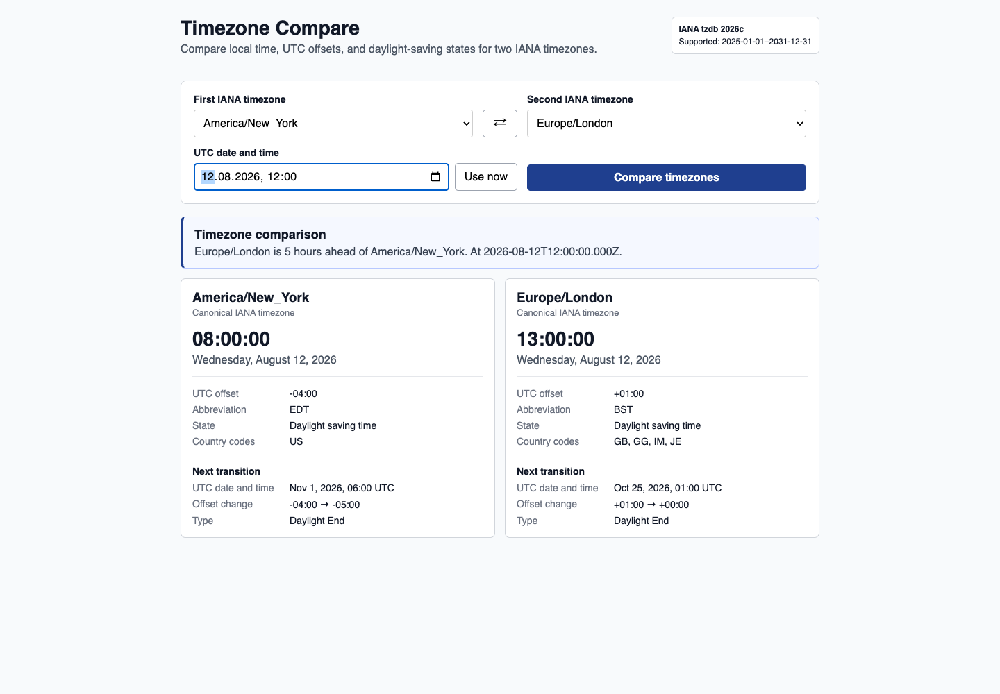

# Timezone Compare: Compare IANA Timezones, UTC Offsets, and DST

Build a timezone compare tool that shows local time, UTC offset differences, abbreviations, daylight-saving states, and upcoming transitions for two [IANA timezones](https://www.npmjs.com/package/@geoapify/iana-timezone-metadata) at the same instant.

## Overview

This build-free JavaScript example compares two canonical IANA timezone identifiers or aliases with `@geoapify/iana-timezone-metadata`. Select two timezones and a UTC date and time to see:

- The local date and time in each IANA timezone.
- The active UTC offset, abbreviation, and standard or daylight-saving state.
- The time difference expressed in plain language.
- Alias-to-canonical timezone resolution.
- The next timezone transition and offset change.

The comparison uses the package's bundled IANA Time Zone Database rather than the host browser's timezone rules.

## Live Demo

[](https://codepen.io/editor/geoapify/pen/019ff968-40b1-7c29-8913-30ec3e1a2b69)

## Screenshot



## Quick Start

Open [`src/index.html`](./src/index.html) in your browser.

No build step or API key is required. The version-pinned package is loaded as an ES module from jsDelivr.

## Project Structure

| File | Purpose |
|------|---------|
| [`src/index.html`](./src/index.html) | IANA timezone selectors, UTC instant input, and comparison results |
| [`src/script.js`](./src/script.js) | Timezone state lookup, offset comparison, and transition rendering |
| [`src/style.css`](./src/style.css) | Minimal responsive layout for the timezone compare tool |

## Key Code Samples

### Compare Two IANA Timezone States

Get the complete state active in each IANA timezone at the same UTC instant, then compare their offset values.

```js
import { getTimezoneState } from "@geoapify/iana-timezone-metadata";

const instant = new Date("2026-08-12T12:00:00Z");
const newYork = getTimezoneState("America/New_York", instant);
const london = getTimezoneState("Europe/London", instant);
const differenceSeconds = london.offsetSeconds - newYork.offsetSeconds;

console.log(newYork.utcOffset);  // "-04:00"
console.log(london.utcOffset);   // "+01:00"
console.log(differenceSeconds);  // 18000 (5 hours)
```

How it works:

- Both state lookups use the same absolute instant.
- `offsetSeconds` is signed east of UTC, so subtracting the values gives the local-time difference.
- Each state also includes an abbreviation, classification, and daylight-saving adjustment.

### Resolve Timezone Aliases Before Comparing

Normalize a known IANA timezone alias before storing it or displaying the canonical timezone identifier.

```js
import { resolveTimezone } from "@geoapify/iana-timezone-metadata";

const firstTimezone = resolveTimezone("US/Eastern");
const secondTimezone = resolveTimezone("Europe/London");

console.log(firstTimezone);  // "America/New_York"
console.log(secondTimezone); // "Europe/London"
```

How it works:

- `resolveTimezone()` accepts either a canonical identifier or a known alias.
- A recognized value returns its canonical IANA timezone identifier.
- An unknown value returns `undefined`.

### Get the Next Timezone Transition

Compare upcoming clock changes by requesting the first transition strictly after the selected instant.

```js
import { getNextTransition } from "@geoapify/iana-timezone-metadata";

const transition = getNextTransition(
  "America/New_York",
  new Date("2026-08-12T12:00:00Z"),
);

console.log(transition.at);
console.log(transition.before.utcOffset);
console.log(transition.after.utcOffset);
console.log(transition.kind);
```

How it works:

- The transition includes the exact UTC instant and complete before/after states.
- `kind` identifies daylight start, daylight end, another offset change, or a designation change.
- A known timezone with no later transition in the supported range returns `null`.

## Geoapify API Key

This timezone compare example reads bundled package data and does not require a Geoapify API key. To combine it with Geoapify geocoding, maps, or other location APIs, create a free key at [myprojects.geoapify.com](https://myprojects.geoapify.com/).

## APIs and Libraries

| Name | Description | Documentation | Used In This Example |
|------|-------------|---------------|----------------------|
| `@geoapify/iana-timezone-metadata` | Provides canonical IANA timezone identifiers, aliases, date-aware states, UTC offsets, abbreviations, and transitions. | [NPM package](https://www.npmjs.com/package/@geoapify/iana-timezone-metadata) | Populates selectors and calculates the complete timezone comparison |
| JavaScript `Intl.DateTimeFormat` | Formats local dates and times after applying package-provided UTC offsets. | [MDN documentation](https://developer.mozilla.org/en-US/docs/Web/JavaScript/Reference/Global_Objects/Intl/DateTimeFormat) | Formats the two local date and time displays |

## Useful Links

- IANA Time Zone Database: [https://www.iana.org/time-zones](https://www.iana.org/time-zones)
- Geoapify API documentation: [https://apidocs.geoapify.com/](https://apidocs.geoapify.com/)
- Geoapify projects and API keys: [https://myprojects.geoapify.com/](https://myprojects.geoapify.com/)
